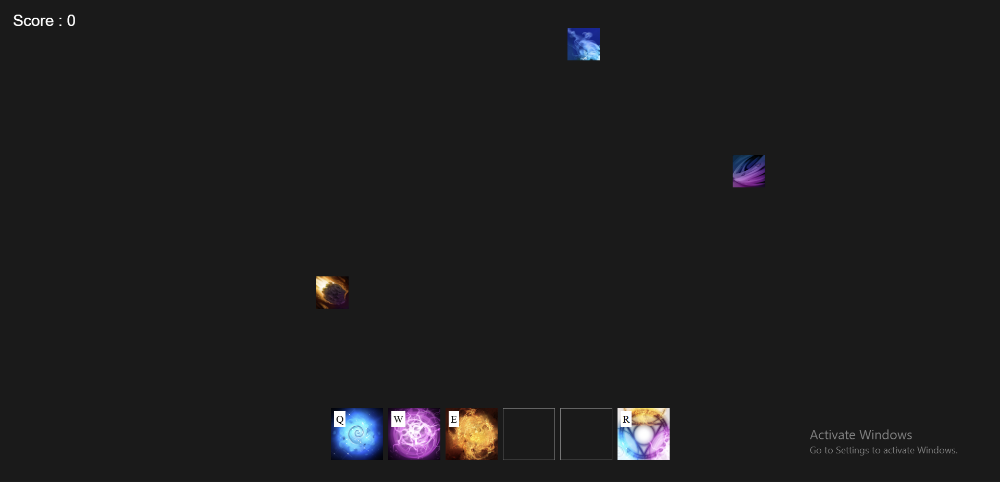

# Invoker Trainer 

Invoker Trainer is a simple web-based game designed to help players learn and memorize Invoker’s spell combinations through fast, repetitive practice.

The goal is to build muscle memory for the **Q / W / E** orb system in a fun, reaction-based format.

---

---
##  How It Works

- Spells fall from the top of the screen one at a time
- Each spell corresponds to a specific **Q / W / E** combination
- The player presses the correct keys before the spell reaches the bottom
- Correct input → **score increases**
- Incorrect or late input → **no score**, next spell continues

The game tracks inputs in real time and gives immediate feedback.

---
## Tech Stack 
   - HTML
   - CSS
   - Canvas
   - JavaScript
---

##  Features

- Real-time key input tracking (Q, W, E)
- Score system to measure accuracy and speed
- Simple mechanics focused on learning, not complexity
- Runs entirely in the browser (no installation needed)

---

##  Getting Started

1. Clone the repository:
   ```bash
   git clone <repo-url>
2. That's it - Start Precticing
